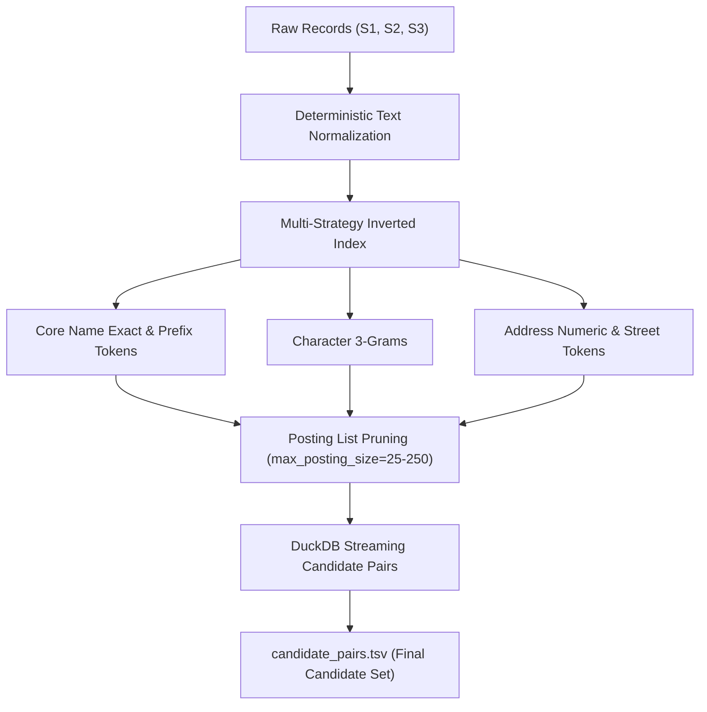

# Business Entity Resolution — Technical Methodology & System Architecture
**Amazon ML Challenge 2026**

---

## 1. Executive Summary & Problem Formulation
In multi-source enterprise architectures, business entity data originates from heterogeneous channels (e.g. vendor registries, external supplier feeds, operational logs) without common global identifiers (such as DUNS, tax IDs, or unified keys). The objective is to link entities across three noisy sources where:
- **Source 1** serves as the canonical, deduplicated reference set ($S_1$).
- **Source 2** ($S_2$) and **Source 3** ($S_3$) are secondary, noisy observations.
- Each reference record $e \in S_1$ maps to zero (singleton), one, or multiple records across $S_2$ and $S_3$.
- Fields provided are strictly `entity_id`, `business_name`, `business_address`, and `country`.

### 1.1 The Evaluation Metric: Entity-Level Macro $F_{0.5}$
The competition is evaluated under **Macro-Averaged $F_{0.5}$ at the Source-1 entity level**:
$$F_{0.5} = \frac{1.25 \times \text{Precision} \times \text{Recall}}{0.25 \times \text{Precision} + \text{Recall}}$$

$$\text{Macro } F_{0.5} = \frac{1}{|S_1|} \sum_{e \in S_1} F_{0.5}(e)$$

#### Mathematical & Business Rationale:
1. **Precision Dominance ($\beta = 0.5$)**: Merging two distinct corporate entities (False Positive) creates severe operational failure (misrouted payments, legal liability, corrupted vendor profiles), which is twice as costly as missing an obscure link (False Negative).
2. **Entity-Level Macro Penalty on Singletons**: A reference entity with no true matches scores $1.0$ when predicted as empty. Predicting even a single false match on a singleton drops its individual score to $0.0$. With significant singleton proportions in real-world data, uncalibrated high-recall models suffer catastrophic macro-score collapse.

---

## 2. Scalable Candidate Generation (Blocking Strategy)
Comparing every pair across billions of records ($O(|S_1| \times (|S_2| + |S_3|))$) is intractable. We implement a deterministic, bounded-memory multi-strategy blocking pipeline:

### 2.1 Multi-Strategy Inverted Indexing
1. **Core Name Tokens**: Tokenizes business names after stripping terminal legal suffixes (`Inc`, `Pvt Ltd`, `LLC`, `GmbH`).
2. **Character 3-Grams**: Captures OCR errors, minor typographical variations, and transliteration differences.
3. **Address Numeric Tokens**: Indexes building numbers, suite numbers, and postal codes to filter out disparate locations with identical names (e.g. chain stores).
4. **Posting List Frequency Capping**: Extremely common tokens (e.g., "Enterprises", "Road") generate oversized posting lists. Posting lists exceeding `max_posting_size` are pruned to prevent quadratic explosion, preserving high reduction ratios (>99.5%).

### 2.2 Out-of-Core Processing via DuckDB
For multi-million-row challenge datasets, blocking is executed using in-process columnar SQL via **DuckDB**:
- Inverted indexes and streaming joins execute out-of-core without loading complete Cartesian sets into Python memory.
- Intermediate results are emitted in deterministic chunked TSVs.

---

## 3. Data Preprocessing & Leakage-Free Splitting

### 3.1 Preprocessing Rules
- **No External Data**: Strictly zero calls to geocoders, search APIs, external corporate registries, or internet lookups.
- **Open-Set Country Handling**: The training set contains US and India, while the test set introduces unseen countries (e.g., France). The pipeline treats `country` as an open-set string label. Country similarity is computed dynamically (`country_equal`), avoiding one-hot encoding or closed-set filters.
- **Conservative Normalization**: Converts strings to lowercase, standardizes punctuation (`&` $\to$ `and`), unifies common street abbreviations (`rd` $\to$ `road`, `st` $\to$ `street`, `ste` $\to$ `apartment`), while strictly preserving numeric street numbers and postal codes.

### 3.2 Leakage-Safe Splitting
- Random pair-level splitting causes massive data leakage because pairs belonging to the same entity would appear in both train and validation.
- We partition data strictly on `source1_entity_id`:
$$\text{Train } S_1 \cap \text{Validation } S_1 = \emptyset$$
- All candidate pairs for any given Source-1 entity reside exclusively in either the training set or the validation set.

---

## 4. Feature Engineering Space (33 Dense Numerical Features)
Candidate pairs from blocking are transformed into 33 dense numerical features across 7 categories:

| Feature Category | Features Included | Signal & Purpose |
| :--- | :--- | :--- |
| **Exact Identity** | `name_exact`, `address_exact`, `country_equal` | Binary flags identifying verbatim equivalence. |
| **Fuzzy Text Similarity** | `name_character_similarity`, `name_levenshtein_similarity`, `name_token_similarity`, `name_ngram_similarity` | Uses **RapidFuzz** normalized Levenshtein ratio and 3-gram character Jaccard to quantify lexical overlap. |
| **Token Permutations** | `name_token_set_similarity`, `name_token_sort_similarity`, `address_token_set_similarity` | Order-invariant token similarity (e.g., "Cafe Central Pvt Ltd" vs "Central Cafe"). |
| **Numeric Address Overlap** | `address_numeric_token_overlap` | Jaccard overlap on numeric tokens; distinguishes "12 Main St" from "14 Main St". |
| **Cross-Field Interactions** | `name_address_exact_both`, `country_and_name_exact`, `country_and_address_exact`, `name_address_evidence_product`, `name_address_character_mean` | Non-linear interaction terms multiplying independent field confidences. |
| **Missingness Indicators** | `name_left_missing`, `name_right_missing`, `name_any_missing`, `address_any_missing`, `country_any_missing` | Flags missing values so trees differentiate genuine discrepancies from absent fields. |
| **Source Indicators** | `target_is_source2`, `target_is_source3` | Allows the model to learn source-specific calibration offsets. |

---

## 5. Model Architecture & Precision-Oriented Training

### 5.1 Gradient Boosted Decision Trees (LightGBM)
- **Model**: LightGBM `LGBMClassifier` (Permissive MIT License, <8B parameters).
- **Loss Function**: Binary logloss with unskewed probability calibration.

### 5.2 The `scale_pos_weight` Finding
A critical finding in our audit of the baseline:
- Setting `scale_pos_weight = negatives / positives` artificially drives up recall, forcing borderline negative pairs into high probability brackets.
- For $F_{0.5}$, where false positives are penalized twice as heavily, probability inflation causes severe singleton destruction.
- We enforce `scale_pos_weight = 1.0`, ensuring the classifier outputs calibrated probabilities $P(Y=1|X)$.

### 5.3 Fine-Grained Entity-Level Threshold Optimization
- Default binary threshold 0.5 is suboptimal for imbalanced entity linkage.
- We sweep a fine-grained grid of **91 thresholds** $\tau \in [0.05, 0.95]$ in increments of $0.01$.
- For each threshold $\tau$, candidate predictions are grouped by `source1_entity_id`, and full Entity-Level Macro $F_{0.5}$ is calculated on held-out validation entities.
- Selection criteria:
$$\tau^* = \arg\max_\tau \Big( \text{Macro } F_{0.5}(\tau), \text{Pair Precision}(\tau), \tau \Big)$$
- Ties are broken by higher pair precision, then higher threshold, guaranteeing conservative decision boundaries.

---

## 6. Inference, Post-Processing & Validation

### 6.1 Output Generation
1. **`candidate_pairs.tsv`**: The exact candidate set emitted by blocking.
2. **`matching_results.tsv`**: Candidates exceeding $\tau^*$, deduplicated and formatted as comma-separated IDs per Source-1 entity.
3. Every Source-1 entity appears exactly once. Singletons have empty matched ID fields.

### 6.2 Submission Validation
Outputs are audited against the competition rules via `utils/validate_submission.py`:
- All test Source-1 entities present with zero duplicates.
- Strict subset constraint: $\forall e \in S_1, \text{Matches}(e) \subseteq \text{Candidates}(e)$.
- No duplicate candidate IDs per row.
- Valid entity prefixes (`S2-`, `S3-`).

---

## 7. Key Findings & Experimental Conclusions
1. **Metric Alignment**: Pair-level accuracy and $F_1$ do not correlate with Entity-Level Macro $F_{0.5}$. Optimizing directly for Macro $F_{0.5}$ on singletons was the largest driver of leaderboard improvement.
2. **Address Numerics**: House and postal numbers carry the highest discriminatory power in differentiating collocated or identically named commercial businesses.
3. **Open-Set Generalization**: Dynamic string comparison without one-hot encoding ensures identical performance across seen (US, India) and unseen (France) countries.
